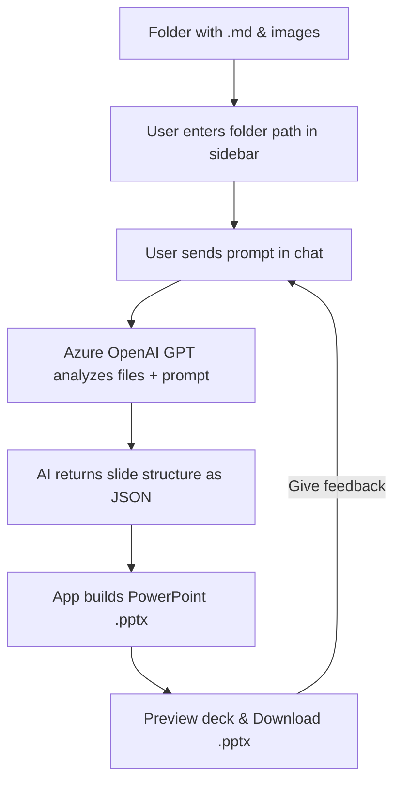

# 🧑‍🏫 ppt_agent: Chat-driven AI Slide-Deck Generator (.pptx)  
  
<p align="center">  
    
</p>  
  
**ppt_agent** is an interactive Streamlit web app for generating and refining PowerPoint slide decks using Azure OpenAI's GPT models. Provide a prompt, plus any supporting `.md` files and images — ppt_agent chats with GPT to structure your content, then builds a downloadable `.pptx` deck automatically. You can iterate via chat to improve slides.  
  
---  
  
## Features  
  
- 💬 **Chat-to-deck:** Describe your topic; AI builds slide titles, bullet points, speaker notes, and selects images automatically.  
- 📁 **Markdown & image ingestion:** Reads all `.md` and image files (`png`, `jpg`, `gif`, etc.) from a folder for context.  
- 🛠️ **Iterative refinement:** Give feedback in chat to revise and regenerate the deck.  
- ⚡ **Preview & download:** Quick HTML preview of autogenerated slides; download the finished `.pptx`.  
- 🤖 **Powered by Azure OpenAI:** Supports GPT-4 or GPT-3.5 via Azure API.  
  
---  
  
## How it Works  
  


## Getting Started  
  
### 1. Clone the repo  
  
```bash  
git clone https://github.com/james-tn/ppt_agent.git  
cd ppt_agent  
```
### 2. Install requirements
Create a Python 3.8+ environment, then:
```bash
pip install -r requirements.txt  
```
### 3. Setup Azure OpenAI credentials
Copy the sample environment file:

```bash
cp .env.sample .env  
```
Edit .env and fill in your credentials:
```bash
AZURE_OPENAI_ENDPOINT="https://<your-azure-resource>.openai.azure.com"  
AZURE_OPENAI_API_KEY="<your-azure-api-key>"  
AZURE_OPENAI_CHAT_DEPLOYMENT="<your-deployed-model-name>"  # e.g. 'o3'  
AZURE_OPENAI_API_VERSION="2025-02-01-preview"  
```
Note: It's best to use a strong reasoning model like o3.

### 4. Prepare your input folder  
  
- Place all `.md` files and images you'd like to use in one folder.  
- Supported image types: `png`, `jpg`, `jpeg`, `gif`, `bmp`, `tif`, `tiff`, `webp`.  
- The folder can have subdirectories — ppt_agent will recursively include all valid files.  
  
### 5. Launch the app  
  
```bash  
streamlit run app.py  
```
Navigate to `http://localhost:8501` in your browser.  
  
---  
  
## Usage  
  
1. **In the sidebar:**    
   - Enter the path to your content folder (with `.md` files and images).  
2. **In the main chat window:**    
   - Type your initial prompt, e.g.:    
     > "Create a 10-slide introduction to quantum computing for high school students. Use images where appropriate."  
   - The AI will analyze your content, build slides, and show a preview.  
3. **Download:**    
   - Click the download button to get your `.pptx`.  
  
4. **Refine:**    
   - Continue chatting to ask for changes, e.g.:    
     > "Add more examples to slide 4."    
     > "Make slide titles more catchy."    
   - Each turn regenerates and updates the presentation.  
  
---  
  
## env File Example  
  
```env  
AZURE_OPENAI_ENDPOINT="https://<your-resource>.openai.azure.com"  
AZURE_OPENAI_API_KEY="<your-key>"  
AZURE_OPENAI_CHAT_DEPLOYMENT="o3"  
AZURE_OPENAI_API_VERSION="2025-02-01-preview"  


